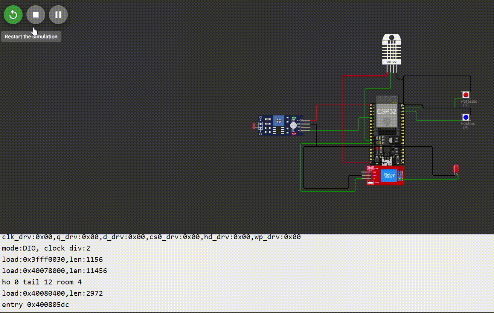

# 🌱 Sistema de Irrigação Inteligente - Entrega 1

## 🔧 Visão Geral

Este projeto simula um sistema inteligente de irrigação usando ESP32, sensores analógicos e digitais, com controle automático da bomba d'água.

## 🧩 Componentes Simulados no Wokwi

| Função | Componente | Pino ESP32 |
|--------|------------|-------------|
| Sensor de Fósforo (P) | Botão       | GPIO 22 |
| Sensor de Potássio (K) | Botão       | GPIO 23 |
| Sensor de pH          | LDR | GPIO 34 |
| Sensor de Umidade     | DHT22       | GPIO 14 |
| Bomba de Irrigação    | LED + relé | GPIO 12 |

## ⚙️ Lógica de Funcionamento

A bomba de irrigação é ativada **quando qualquer** uma das seguintes condições for detectada:

- Umidade do solo < 30%
- Ausência de fósforo (botão de fósforo solto)
- Ausência de potássio (botão de potássio solto)
- pH fora da faixa ideal (5.5 a 7.5)

  
## 🎥 Simulação do Circuito




```cpp
if (umidade < 30 || !fosforo || !potassio || ph < 5.5 || ph > 7.5) {
  digitalWrite(RELE_PIN, HIGH); // Liga a bomba
} else {
  digitalWrite(RELE_PIN, LOW);  // Desliga a bomba
}
```

# 📦 Entrega 2 - Armazenamento de Dados com Python e Banco SQL

## 🔍 Objetivo

Esta etapa do projeto visa armazenar os dados coletados da simulação com ESP32 em um banco de dados SQL usando Python. Foram implementadas as operações básicas de inserção, leitura, atualização e exclusão (CRUD), simulando o armazenamento local das leituras do sistema de irrigação inteligente.

---

## 🗃️ Estrutura do Projeto

📁 entrega2/
├── 🐍 banco.py # Script principal em Python
├── 📄 dados.txt # Leituras copiadas do monitor serial do ESP32
└── 🗃️ irrigacao.db # Banco de dados SQLite gerado automaticamente

---

## 📥 Formato dos dados simulados (`dados.txt`)

Os dados são extraídos do monitor serial com o seguinte formato:

Umidade: 45.00 % | P: 1 | K: 1 | pH: 6.75
Umidade: 28.00 % | P: 0 | K: 1 | pH: 5.20
Umidade: 65.00 % | P: 1 | K: 0 | pH: 7.80


Cada linha representa uma leitura capturada pelo sistema.

---

## 🧠 Modelo da Tabela

A tabela criada no banco de dados `irrigacao.db`:

| Campo      | Tipo     | Descrição                              |
|------------|----------|----------------------------------------|
| id         | INTEGER  | Identificador único (auto incremento) |
| umidade    | REAL     | Umidade do solo (%)                   |
| fosforo    | INTEGER  | 1 (presente) ou 0 (ausente)           |
| potassio   | INTEGER  | 1 (presente) ou 0 (ausente)           |
| ph         | REAL     | Valor do pH do solo                   |
| timestamp  | TEXT     | Data e hora da inserção               |

---

## ⚙️ Funcionalidades do `banco.py`

- Criação da tabela no banco (`CREATE`)
- Leitura do arquivo `dados.txt` e inserção no banco (`INSERT`)
- Listagem de todos os registros (`SELECT`)
- Atualização de dados (`UPDATE`)
- Remoção de um registro (`DELETE`)

---

## ▶️ Como Executar

No terminal, dentro da pasta `entrega2`, rode:

```bash
python banco.py

